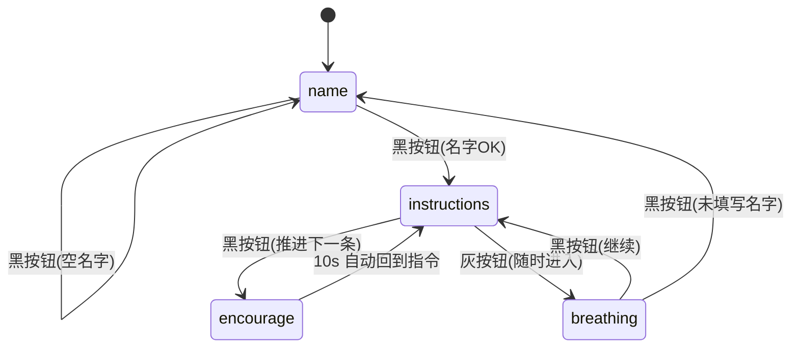

# 交互性技术文档（StarBuddy2：监护人端 / 用户端）

更新时间：2026-03-15
# 一句话定义产品：一个帮助家长和ASD儿童建立心理联系、辅助星星的孩子成长APP #
<details>
<summary><strong>2026-03-15 交互变更摘要（点击展开）</strong></summary>

- 用户端小狗“从左到右循环奔跑”耗时调整为 **15 秒**。
- 进入“深呼吸”界面时：小狗回到初始位置/大小，并**清空黑色按钮计数**（从头开始）。
- 用户端提示词为“听一首歌”时：若监护端已上传音频（`musicUploadUrl` 存在），自动播放 **30 秒**，音量为 **10%**。
- 监护端对话接口等待时间上调（前端请求超时从 30s → 120s）；后端对话模型新增 **DeepSeek（OpenAI 兼容）**配置项。
## 核心亮点：高垂直型，界面友好简洁，交互可调指令清晰 \n 有电子宠物和放松训练，帮助缓解 ##
</details>
聚焦“交互怎么发生”：**页面如何切换、按钮/计时器如何驱动状态变化、前后端如何读写数据、端角色如何限制功能**。适合用于：
- 产品/设计/研发对齐交互细节
- 新同学快速理解双端（角色）结构
- 后续迭代时避免破坏既有交互契约

---

## 1. 两端（角色）与入口

本项目当前是“**同一套前端 + 两种端角色**”，不是两个前端端口。

### 1.1 端角色定义
- **监护人端**：以原有功能为主；通过“设置”页编辑“用户端设置”，实现对用户端指令/主题的配置与同步。
- **用户端（孤独症患者端）**：全屏深色极简交互；保留“安全岛”“拾一封信”，新增引导与指令循环。

### 1.2 入口与路由
- `/entry`：端角色选择页（监护人端 / 用户端）
- `/login`：原登录页（UI/交互保持不变）
- `/patient`：用户端全屏引导流程（不要求登录，可本地模式；登录后可同步）

### 1.3 端角色的持久化
前端以 `localStorage.app_role` 作为端角色状态：
- `guardian`：监护人端
- `patient`：用户端

相关实现：
- `frontend/src/stores/app.js`：`useAppStore()` 读写 `app_role`
- `frontend/src/router/index.js`：路由守卫强制先选择端角色

---

## 2. 前端交互架构（高层）

### 2.1 全局 UI 壳层的显示规则
用户端需要“全屏、低干扰”，因此在以下情况隐藏全局 UI（AppBar / Footer / FloatingDock / GuideBubble / CouncilFlashOverlay）：
- 当前路由 `meta.hideGlobalUI === true`（例如 `/entry`、`/patient`）
- 或当前端角色为 `patient`

相关实现：
- `frontend/src/App.vue`：`hideGlobalUI` 计算属性 + 条件渲染

### 2.2 路由守卫（Role Gate + Role Allowlist）
`frontend/src/router/index.js` 的核心逻辑：

1) **强制先选端角色**
- 除了 `/entry` 本身，若 `app_role` 未设置 → 重定向到 `/entry?next=...`

2) **用户端路由白名单**
- 用户端仅允许访问少量路由：`Entry / Patient / Immersive / Social / Login`
- 不在白名单 → 强制回到 `/patient`

3) **监护人端阻止进入用户端页面**
- 监护人端禁止进入：`/patient`、`/immersive`、`/social`
- 避免误入用户端体验造成困惑

> 说明：当前代码层面把“安全岛/拾一封信”视为用户端功能，因此监护人端被禁止进入 `/immersive` 与 `/social`。

---

## 3. 用户端（/patient）交互状态机

用户端主要由一个组件承载：
- `frontend/src/views/Patient.vue`

它是一个单页状态机，核心状态 `mode`：
- `name`：询问名字
- `breathing`：深呼吸引导
- `instructions`：指令循环

同时存在**两个固定按钮**（所有状态始终可见、位置固定）：
- 灰色按钮：进入/重启“深呼吸”
- 黑色按钮：继续（推进到下一步/下一条）

<details>
<summary><strong>状态机图（Mermaid，点击展开）</strong></summary>



</details>

### 3.1 进入用户端后的流程
1) 用户从 `/entry` 选择“用户端” → 跳转 `/patient`
2) `/patient` `onMounted()`：
   - 读取档案名与用户端设置（优先后端；无 token 则本地）
   - 应用主题（背景色与缓慢变色）

### 3.2 Name 页（mode = name）
UI 规则：
- 背景：深色主题（默认 `#0B1B3A`）
- 主提示文案：白色 `48px`，“你叫什么名字”（上移布局）
- 输入框：用于输入名字

交互规则（黑色按钮）：
- 若名字为空：阻止进入下一步，显示错误提示“名字不能为空”
- 若名字非空：保存名字，然后进入 `instructions`

保存策略：
- 有登录 token：调用后端 `PUT /api/me/patient-profile`
- 无 token：保存本地 `localStorage.patient_profile_local`

### 3.3 深呼吸页（mode = breathing）
进入方式：
- 灰色按钮随时进入深呼吸页（不依赖当前状态）

进入时的“重置”行为：
- **清空黑色按钮计数**（用于小狗成长/动画）：
  - 有 token：调用 `POST /api/me/patient-metrics/black-click/reset`
  - 无 token：写入 `localStorage.patient_black_click_count_local=0`
- 因为计数清零，小狗会回到初始位置与大小（见 3.6）。

动画与计时：
- 标题：白色 `48px`，“深呼吸”
- 下方提示词（吸气/呼气）：
  - 7 秒一段：`吸气` → `呼气`
  - 字号做 14 秒循环动画：`12px → 50px → 12px`
  - 共 3 个完整循环（约 42 秒）
- 3 轮结束：标题变为 “你感觉就好一点了吗”

黑色按钮行为：
- 若未输入名字：跳回 `name` 并提示“请先输入名字”
- 否则进入 `instructions`

### 3.4 指令循环页（mode = instructions）
指令来源：
- 有 token：调用 `GET /api/me/patient-settings`
- 无 token：读取 `localStorage.patient_settings_local`（若无则使用默认指令）

默认指令（循环）：
- 找到水杯 → 喝一口水 → 找到椅子 → 坐下来 → 听一首歌 → 休息 → 画一幅画 → 跳一跳

计时与提示：
- 每条指令展示 20 秒
- 20 秒到：显示提示“点击黑色按钮继续”（白色 `32px`）
- 黑色按钮随时可点：立即推进下一条，并重置 20 秒计时
- 末尾后回到第一条（循环）

音乐提示词（听一首歌）：
- 当提示词为 **“听一首歌”** 且检测到 `musicUploadUrl`（监护端已上传音频）时：
  - 自动播放 **30 秒**
  - 音量固定为 **10%**（浏览器/系统音量的相对比例）
- 说明：浏览器的自动播放策略可能会限制“非用户手势触发”的播放；若遇到 `NotAllowedError`，需在同站点有过交互后才更稳定。

### 3.5 用户端菜单（安全岛 / 拾一封信）
用户端右上角有“菜单”按钮，打开后可进入：
- **安全岛**：跳转 `/immersive`
- **拾一封信**：跳转 `/social?tab=bottle&action=pick`

> `Social.vue` 在用户端模式下会强制展示漂流瓶（bottle）并隐藏 “连线匹配” 标签。

---

### 3.6 小狗伙伴（黑色按钮计数 → 形态/奔跑）
用户端页面右下角/底部附近常驻一只 SVG 小狗（不阻挡交互）。

计数来源：
- **仅在 `instructions` 状态**，按一次黑色按钮会计数 +1（用于“成长/动画”）。
- 计数读取顺序：有 token → `GET /api/me/patient-metrics`；无 token → `localStorage.patient_black_click_count_local`。

形态阶段（阈值）：
- `blackClickCount <= 2`：`small`
- `2 < blackClickCount <= 4`：`big`
- `4 < blackClickCount <= 8`：`walk big`（原地抖动）
- `blackClickCount > 8`：`run big`（从左到右循环奔跑）

奔跑速度：
- `run big` 的横向穿越时间为 **15 秒**（从屏幕左侧外 → 右侧外，循环）。

---

## 4. 监护人端：用户端设置的编辑与同步

监护人端的入口是原有 `/login` 登录流程，登录后进入原有体验。

### 4.1 编辑入口
在 `frontend/src/views/Settings.vue`（设置页）新增卡片：
- “用户端设置”（仅 `app_role=guardian` 时显示）

### 4.2 可编辑内容
1) **指令列表**
- 支持增删改
- 支持上下移动排序
- 支持“恢复默认”

2) **背景与缓慢变色**
- `baseColor`：背景色（Hex 字符串）
- `enableTransition`：是否启用缓慢变色
- `transitionToColor`：目标色
- `transitionDurationSec`：变色时间（秒）

### 4.3 保存与同步
点击“保存并同步”：
- `PUT /api/me/patient-settings`
- 成功后显示“已同步到用户端”

> 用户端下次进入 `/patient` 会拉取并应用最新的设置；如果你需要“实时生效”，建议后续增加轮询或 SSE 推送（当前未实现）。

---

## 5. 前后端交互契约（API + Header）

### 5.1 鉴权 Header
前端请求默认使用自定义头以避免环境冲突：
- `X-Auth-Token: <access_token>`

后端兼容：
- `X-Auth-Token`
- `Authorization: Bearer <token>`
- SSE 情况下也支持 `?token=...`

相关实现：
- `backend/api/dependencies.py`：`get_auth_token()` / `get_current_user_id()`

### 5.2 用户端档案 API
Base：`/api/me`

- `GET /patient-profile`
  - Response：`{ "display_name": "..." }`

- `PUT /patient-profile`
  - Body：`{ "display_name": "..." }`
  - Response：`{ "display_name": "..." }`

### 5.3 用户端设置 API
Base：`/api/me`

- `GET /patient-settings`
  - Response：
    ```json
    {
      "instructions": ["..."],
      "theme": {
        "baseColor": "#0B1B3A",
        "enableTransition": false,
        "transitionToColor": null,
        "transitionDurationSec": 30
      },
      "musicUploadUrl": "/uploads/music/<user_id>/<file>"
    }
    ```

- `PUT /patient-settings`
  - Body 与 Response 同上
  - 约束：
    - `instructions` 为空时后端会回退默认指令
    - `transitionDurationSec` 范围 1~600

相关实现：
- `backend/api/patient_endpoints.py`
- `backend/models/schemas.py`：`PatientProfile* / PatientSettings*`

---

## 6. 本地存储键（LocalStorage Contract）

通用：
- `app_role`：`guardian|patient`
- `access_token` / `refresh_token` / `user`：登录态与用户信息（监护人端）

用户端离线（无 token）场景：
- `patient_profile_local`：名字
- `patient_settings_local`：指令与主题（当前仅预留读取；写入主要由监护人端同步，后续可扩展为用户端离线修改）
- `patient_black_click_count_local`：黑色按钮计数（小狗成长/奔跑）

> 只要你清空 `app_role`，刷新后就会回到 `/entry` 重新选择端角色。

---

## 7. 运行与调试（PowerShell）

建议按“后端 → 前端”的顺序启动。

### 7.1 后端（8000）
```powershell
cd D:\StarBuddy2\StarBuddy
python -m venv .venv
.\.venv\Scripts\Activate.ps1
pip install -r requirements.txt

$env:ENVIRONMENT="development"
$env:ALLOWED_ORIGINS="http://127.0.0.1:5173,http://localhost:5173"

uvicorn backend.main:app --host 127.0.0.1 --port 8000 --reload
```

### 7.2 前端（5173）
```powershell
cd D:\StarBuddy2\StarBuddy\frontend
npm install

# Vite 代理转发 /api 到后端
$env:VITE_PROXY_TARGET="http://127.0.0.1:8000"

npm run dev -- --host 127.0.0.1 --port 5173
```

访问：
- `http://127.0.0.1:5173/` → `/entry` 选择端角色

### 7.3 常见调试点
- 后端首次启动下载 embedding 模型，期间接口可能返回 `degraded`（但仍可用）
- 如果端口被占用：把后端改到 8001，同时把 `VITE_PROXY_TARGET` 改到 8001
- 用户端看不到设置变化：确认监护人端已点击“保存并同步”，且用户端重新进入 `/patient` 会重新拉取

---

## 8. 对话模型接入（DeepSeek / DashScope）
后端对话生成走 OpenAI 兼容协议客户端，支持多提供方：`dashscope` / `deepseek`。

<details>
<summary><strong>DeepSeek（推荐）环境变量（点击展开）</strong></summary>

```powershell
# 后端环境变量（启动 uvicorn 前设置）
$env:DIALOGUE_PROVIDER="deepseek"
$env:DEEPSEEK_API_KEY="你的DeepSeek_API_KEY"
$env:DEEPSEEK_BASE_URL="https://api.deepseek.com/v1"    # 可选
$env:DEEPSEEK_MODEL="deepseek-chat"                    # 可选

# 超时/重试（可选，用于避免前端等待超时）
$env:DIALOGUE_API_TIMEOUT_SECONDS="45"
$env:DIALOGUE_API_MAX_RETRIES="1"
```

</details>

<details>
<summary><strong>DashScope 环境变量（点击展开）</strong></summary>

```powershell
$env:DIALOGUE_PROVIDER="dashscope"        # 可选；留空也会自动选择
$env:DASHSCOPE_API_KEY="你的DashScope_API_KEY"
$env:DASHSCOPE_DIALOGUE_MODEL="qwen-max"  # 可选
```

</details>

前端监护端对话请求超时：
- `frontend/src/api/dialogue.js` 的 axios timeout 为 **120s**（避免 30s 过短导致“总是超时”）。

---

## 9. 通过二维码体验（可行性与操作）
目标：手机/平板扫码后直接进入体验入口（一般是 `/entry`）。

可行性：可行，前提是“前端可被手机访问到”。常见做法有三种：

1) **同一局域网（最快，适合现场演示）**
- 电脑启动后端：`uvicorn backend.main:app --host 0.0.0.0 --port 8000 --reload`
- 电脑启动前端：`npm run dev -- --host 0.0.0.0 --port 5173`
- 在手机上访问：`http://<电脑局域网IP>:5173/`
- 用任意二维码工具生成该 URL 的二维码即可
- 注意：需要放行系统防火墙端口（Windows 入站规则 5173/8000）

2) **公网部署（最稳定，适合长期体验）**
- 购买/准备一台云服务器（或可用的容器平台），部署 `backend + frontend + nginx`（仓库已有 `docker-compose.yml` / `Dockerfile` 可作为起点）
- 配置域名与 HTTPS（建议，否则移动端部分能力/浏览器策略可能受限）
- 二维码指向你的公网域名，例如：`https://your-domain.com/entry`

3) **临时隧道（适合远程分享，依赖第三方）**
- 使用 `cloudflared` / `ngrok` 等把本地 `5173` 暴露成公网 URL
- 二维码指向该临时 URL
- 注意：临时域名可能变化，且需要额外的安全评估
